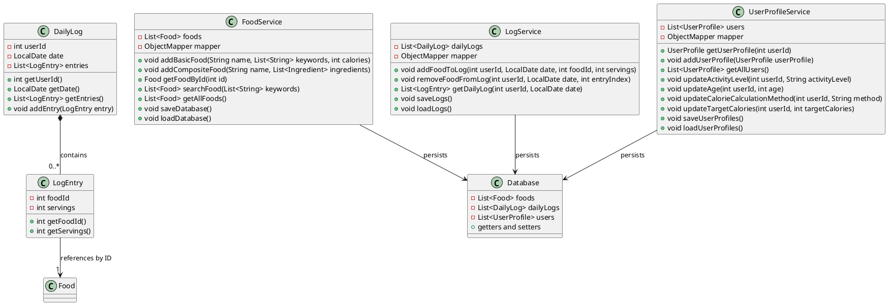
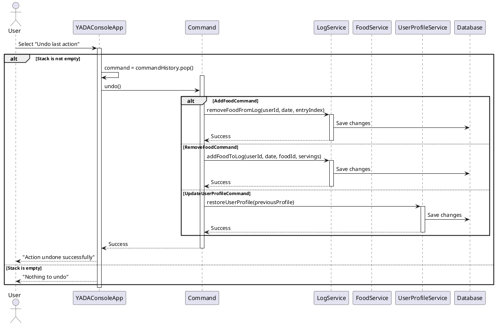

# Design Document for YADA: Yet Another Diet Assistant  

## Title Information  
**Project Name**: YADA: Yet Another Diet Assistant  
**Date**: [5 apirl 2025]  
**Team Members**:  
- Ved 2023101006  
- Mayank 2024121005  

---

## Overview  

YADA is a Java-based console application designed to help users track their food intake, manage daily calorie consumption, and achieve dietary goals. The application provides a user-friendly interface for managing food databases, logging daily food consumption, and calculating calorie targets using industry-standard formulas.  

### Key Features  
- **User Profile Management**: Create and manage user profiles with gender, height, weight, age, and activity level.  
- **Food Database**: Add, search, and manage both basic and composite foods.  
- **Daily Food Logging**: Track daily food intake with servings and view logs for any date.  
- **Calorie Target Calculation**: Calculate calorie targets using multiple methods (e.g., BMR, Mifflin-St Jeor).  
- **Undo Functionality**: Undo actions to an indefinite depth during a session.  
- **Persistent Storage**: Save and load data using JSON files for seamless session continuity.  

---

## UML Diagrams  
### Complete Class Diagram 
  
## Breakdown of whole Class daigram 
#### Food and Ingridents 
  

#### Services and Log  
  
#### User Profile  
  

## Sequence Diagrams  

1. **Calculate Target Calories**  
  
*(This sequence diagram illustrates the process of calculating a user's target calorie intake based on their profile and selected method.)*  

2. **Add Food to Daily Log**  
  
*(This sequence diagram shows how a user adds food items to their daily log, including portion size and date selection.)*  

3. **Create Composite Food**  
  
*(This sequence diagram demonstrates the creation of a composite food item by combining multiple basic food items.)*  

4. **Save and Load Data**  
  
*(This sequence diagram details the process of saving user data to a file and loading it back into the application.)*  

5. **Undo Command**  
  
*(This sequence diagram explains the undo functionality, allowing users to revert their last action during a session.)*  

---

## Design Narrative  

The design of YADA reflects a balance among key software engineering principles:  

### Low Coupling  
- Each service (e.g., `FoodService`, `LogService`, `UserProfileService`) operates independently, interacting only through well-defined interfaces.  
- The `Command` interface ensures that undo functionality is decoupled from the core application logic.  

### High Cohesion  
- Classes are designed with a single responsibility, such as `Food` for representing food items and `DailyLog` for managing daily food entries.  
- Services encapsulate related operations, ensuring cohesive functionality.  

### Separation of Concerns  
- The application separates concerns across layers:  
    - **Model Layer**: Represents core entities like `Food`, `UserProfile`, and `DailyLog`.  
    - **Service Layer**: Handles business logic and data persistence.  
    - **UI Layer**: Manages user interactions via the console.  

### Information Hiding  
- Private fields and encapsulated methods ensure that internal details of classes are hidden from external access.  
- The `Database` class abstracts data storage, preventing direct manipulation of raw data.  

### Law of Demeter  
- Methods interact only with immediate collaborators, reducing dependencies and improving maintainability.  
- For example, `YADAConsoleApp` interacts with services rather than directly accessing model objects.  
---

## Reflection  

### Strongest Aspects  
1. **Extensibility**: The design supports adding new calorie calculation methods or food data sources with minimal changes.  
2. **Undo Functionality**: The command pattern enables robust undo operations, enhancing user experience.
3. **Data Abstraction**: Separate classes for JSON data handling simplify integration of new data sources without modifying core components.
4. **Interface-based Design**: Clear interfaces allow for multiple implementations of algorithms, following good object-oriented principles.
5. **Single Responsibility Principle**: Each component has a clear, focused purpose with well-defined responsibilities.
6. **Dependency Inversion**: Components depend on abstractions rather than concrete implementations, improving flexibility.
7. **Testability**: The interface-driven architecture makes components easily mockable for unit testing.

### Weakest Aspects  
1. **Scalability**: The current in-memory storage approach may not scale well for large datasets.  
2. **Error Handling**: Limited error handling in user input and file operations could lead to runtime issues.  

---  
